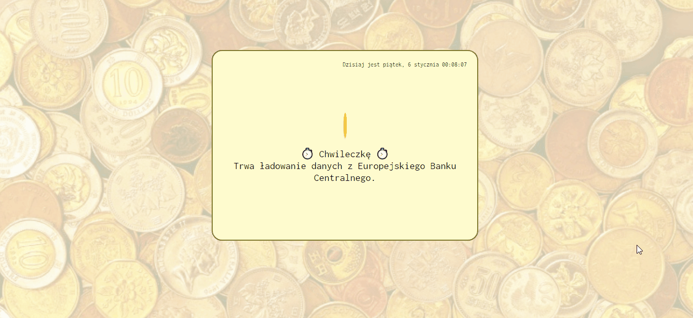
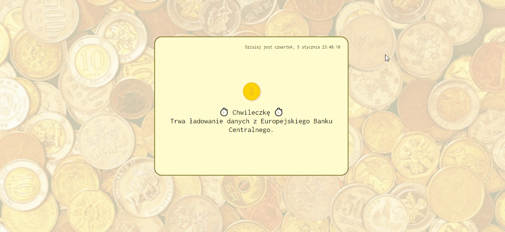

##  Currency Converter Website

 Made by Klaudia Kępka

##  Currency Converter React Demo Website:
[Currency Converter React Demo Website](https://kepkaklaudia.github.io/currency-converter-react/)

##  Quick Preview

## First field
In the first field, you can enter the amount in PLN that you want to convert to another currency. You can enter the amount using the keyboard or use the arrows hidden in the right part of the field. The accuracy is 0.01.

## Second field
Here you can choose the currency to which you want to convert your PLN amount. You can choose EUR, USD, GBP or CHF.

## "Przelicz kwotę!" button
There is a special button below the fields. When you click it, the converter can do the calculations.

## Results
When you click "Przelicz kwotę!" button, you will see your amount in the new currency after the words "Nowa kwota wynosi:"

## Responsive version
When you are in mobile mode (maximum width of screen: 600px) you can notice some changes. 
The box is slightly smaller and the fields are arranged in one column to fit on mobile screens.

## API Data
Exchange rates are taken from the European Central Bank, so the calculated values ​​are up-to-date.

If the calculator fails to download data from API, the user will be shown the appropriate failure information.

In addition, in the upper right corner of the calculator you can see the current time and date.

# Getting Started with Create React App

This project was bootstrapped with [Create React App](https://github.com/facebook/create-react-app).

## Available Scripts

In the project directory, you can run:

### `npm start`

Runs the app in the development mode.\
Open [http://localhost:3000](http://localhost:3000) to view it in your browser.

The page will reload when you make changes.\
You may also see any lint errors in the console.

## Technologies used
     

   